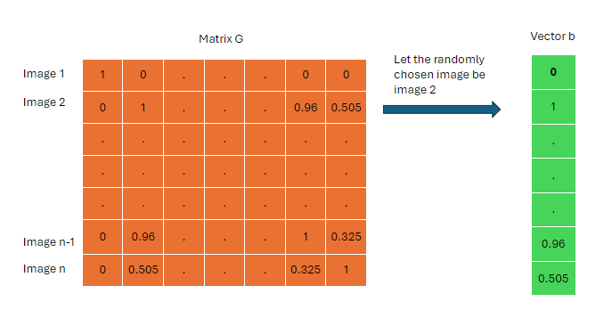

# data processing
The following will exemplify how we process our data to obtain our desired values.

# Overview
The methods described in the main readme are implemented here

Each method, the brute force and sampling method, are made into their own object (BruteForceEstimator and SampleEstimator respectively)

Since the Sample method needs a test set in order to get meaningful results, the object SampleTester is needed.

Both BruteForceEstimator and SampleTester have inheritance from TestableEstimator, which is done so the same visualization functions can be used on both later.

## BruteForceEstimator
After the initialization function is called, it carries out the following 
1. Generate images set using ImageGenerators based on the imageType
2. Filters the images set using Filters based on the filters
3. Uses the filtered image set to generate the image product matrix (matrix G)
4. Applies the embedding method based on embeddingType to find the nearest correlation matrix (matrix G') and the embedding matrix (matrix A)
## SampleEstimator
After the initialization function is called, it carries out the following
1. Uses the input image set to generate an image product matrix (TAKE NOTE: This is NOT the matrix G used in visualization, as this is the training set. The data from the test set should be the one used in visualization)
2. Applies the embedding method based on embeddingType to find the nearest correlation matrix (matrix G') and the embedding matrix (matrix A)

SampleEstimators have a function get_embedding_estimate() which takes in an input image (of the same dimensions as images in the training set) and uses the sample images to calculate an image embedding for the input image

## SampleTester
After the initialization function is called, it carries out the following
1. Uses the test image set to generate the image product matrix (matrix G)
2. Uses the input sampleEstimator to generate vector embeddings for each of the test images. This generates the embedding matrix (matrix A)
3. Matrix G' is obtained by A.T A

## ImageProducts
There are many different types of Image products such as the normalised cross correlation [(NCC)](https://ietresearch.onlinelibrary.wiley.com/doi/full/10.1049/ell2.12516#ell212516-bib-0003), the mutual information [(MI)](https://ietresearch.onlinelibrary.wiley.com/doi/full/10.1049/ell2.12516#ell212516-bib-0004) and the structural similarity [(SSIM)](https://ietresearch.onlinelibrary.wiley.com/doi/full/10.1049/ell2.12516#ell212516-bib-0005) that we can employ to quantify similarities between different images. So far only NCC has been implemented under [ImageProducts.py](ImageProducts.py). 

Using the code we are able to obtain our image product matrix, which we will denote as $G$, which represents the image products between one randomly chosen image and every other image in a subset (The chosen image itself does not have to be included in the subset). 
We can also obtain an image product vector, known as $b$, which is essentially just the row in G which represents our chosen vector. 




## Sampling Method
Allows us to sample a population of images. 
(i.e. take a small subset of matrices from the total set of matrices)

For example the total population of 3x3 binary images is 64, while the total population of 4x4 binary images is 900+. This sampling method allows us to take a small sample of around 50 images from the 900+ population of images.

Advantages include not having to produce all 900+ images which takes a super signficant amount of time, and that we are able to obtain a function that can have a vector representation of an image without having the image itself. 

## Filters
A filter is a specific restriction we place on our sample of images, filters available are shown below:
1. Unique
Every matrix in the sample subset will be unique from each other i.e. no two matrices will be the same
2. Max Ones
A percentage is input into Max Ones. 
When creating binary matrices, the percentage of 1s will not exceed Max Ones. For example, 

Max Ones = 50%
An example binary 3x3 grid is 

```
[[0,0,0]
[0,1,1]
[1,1,0]]
```
The percentage of ones in the matrix is 44.4%
A second grid will be 

```
[[1,0,0]
[0,1,1]
[1,1,0]]
```
The percentages of ones in the second matrix is 55.6%
Therefore the first matrix will be accepted while the second matrix will be rejected under the Max Ones condition.

3. One Island
An island is defined as an isolated region of 1's (the 1's are connected to each other in the 4 cardinal directions)

For example in the matrix
```
[[1,1,1]
[0,1,0]
[0,0,1]]
```
The first island are the four continuously connected 1s that form the T-block, while the second island is the sole 1 in the bottom right corner of the matrix, meaning that this matrix has 2 islands.

The 1 island filter will only allow our sample of matrices to have 1 island in it.

All the three filters listed above can be used in conjunction, so that we can create different combinations of samples that are filtered differently, allowing us to analyse the different properties of said samples.


