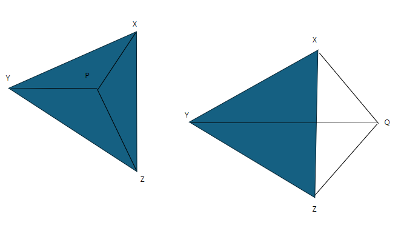

## Generate Triangle
We want to generate a triangle filled with 1s.
We loop through the matrix, and use the algorithm below to figure out if the point is inside the triangle. If it is, it becomes a 1.

### Algorithm

In order to find the location of P, we first find the areas of $\triangle PXY$, $\triangle PYZ$, and $\triangle PZX$, and if 
$$ \triangle PXY + \triangle PYZ + \triangle PZY = \triangle XYZ $$
we can say that the point P in located within the $\triangle XYZ$

In the second triangle, 
$$ \triangle QXY + \triangle QYZ + \triangle QZY > \triangle XYZ $$
therefore the point Q is not located within the $\triangle XYZ$, and the point will remain a zero.

