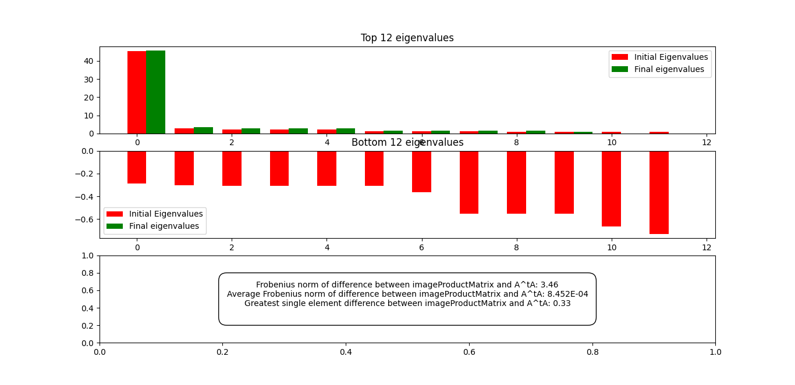

# Code overview
## BFmethod
Functions which graph out the performance of a BruteForceEstimator. Some functions can be applied to a TestableEstimator, so performance of a SampleEstimator can also be found (by passing it in a SampleTester)

### investigate_K

Generates histograms to display the effect of increasing values of k on the k-score.

### investigate_estimator

Generates graphs to display the effect of pencorr on the eigenvalues and the effect of increasing k on the k-score
for some randomly chosen images.

### investigate_BF_rank_constraint

Generates a line graph to display how the k-score changes as the rank constraints change for some specified k.

### investigate_BF_rank_constraint_for_image_types

The above, but for multiple image types at the same time. Different embedding methods and image products (monotonic transformations)
can be used for each image type.

### investigate_BF_weight_power

Plots of graph of k-score against the power of NCC score used in the weighting matrix H.

### investigate_plateau_rank_for_set_sizes

Generates a graph of the plateau rank against image set sizes. Groups image sets by image size before plotting a 
separate line for each.

### investigate_plateau_rank_for_image_sizes

Same as the above but groups the image sets by image set sizes before plotting against image sizes instead.

### investigate_goal_rank_for_set_sizes

Generates a graph of goal rank at which a specific k-score is achieved against image set sizes.

This method requires testing and bugs may be present.

## SampleMethod
Functions which sweep parameters for a SampleTester.

### investigate_training_size

Generates a graph to investiage the effect of changing training set size on k-score

### investigate_tester_rank_constraint

Generates a graph of k-score against the rank constraint imposed on G'. Tests against a test set using Lagrangian method.

### investigate_training_size_for_image_products

Same as first method but allows for the use of different image products (monotonic transformations) and image products.

### investigate_tester_rank_constraint_for_image_products

Same as second method but allows for the use of different image products (monotonic transformations) and image products.

### investigate_sample_and_test_sets

Same as second method but allows for separate training and test sets (i.e. generate embeddings using triangles but
test on quadrilaterals).

### investigate_sample_plateau_rank

Investigates the plateau rank when testing on embeddings generated using the Lagrangian method.

## GraphEstimates
Functions which take in data and make a matplotlib graph on the input axes. Only formats the plot, no additional data processing is done.

# Plotted Graphs
The following will be a detailed explanation on the graphs plotted in GraphEstimates.py and the metrics we use to detect any trends between different data distributions.

## Plot Eigenvalues
Matrix $G$ contains the vectors that embed the $n$ images, where each column of the matrix has an individual vector with $dim(d)$.

We used our rank reduction algorithm *Pencorr.m* to reduce the rank and turn Matrix $G$ **positive semi definite** (PSD) by removing the negative eigenvalues from Matrix $G$, while also ensuring that it remains a **correlation matrix** (Diagonals have value equal to 1), and ensuring that the **Fronbenius Norm** of $|G-G^{\prime}|$ is minimised (in order to get the nearest correlation matrix). 

 

For example, using a 64 by 64 matrix, we will be able quantify the error between the eigenvalues when we run the code through it. We do this by plotting the top **12** eigenvalues and the bottom **12** eigenvalues and visualing them using the bar graphs shown below (The second graph has no green rectangles as all the negative eigenvalues have already been zeroed).

 

As seen above, the eigenvalues as seen in graph 1 tend to be quite close together, insinuating that there is minimal changes in the eigenvalues, which fits with our theory that the Frobenius Norm is minimized. The second graph visualises the potential change in zeroing the negative eigenvalues and is another indicator of how much the Frobenius Norm changes.  

## K_neighbour score
For example, given a population of 64 images, we select a subset of 21 images, where 1 of them will taken out and chosen as the **testing image**, and the 20 remaining images will be the **sample subset**.

Let $x$ be the vector embedding of the testing image, and $b$ is the vector representing the image product (currently only NCC) of the testing image and the images in the sample subset.  

We can define a new vector $b_1$, where $b_1$ is the dot product of $x_{special}$ and the vectors representing the images in the sample subset. 

The highest values in vectors $b_0$ and $b_1$ represent the k images that are closest to the testing image, and their indices will be placed in sets $c_0$ and $c_1$. The k_neighbour score is represented by the number of elements in the intersection between $c_0$ and $c_1$. The full diagram is illustrated in the example below. 

When we use Pencorr.m to constrain the rank of the vector $x_{special}$, the k nearest neighbours score will vary, and we can analyse the trend of the k nearest neighbours score. This allows us to determine a specific rank where the dimension of $x_{special}$ can be reduced to.
